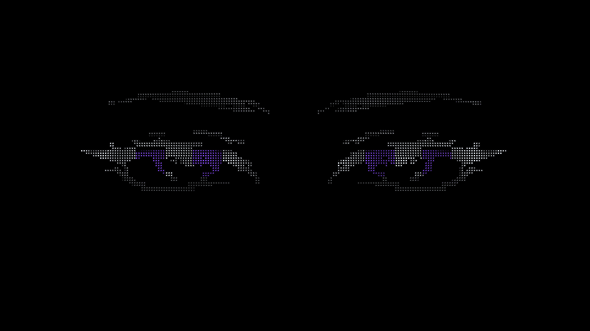

# J · Living Eyes

A lightweight, interactive **WebGL wallpaper for Wallpaper Engine**. A dot-matrix gaze follows your cursor, blinks, breathes, and moves in pseudo-3D — all generated continuously in code.



**[Try locally](#try-it)** · **[Wallpaper Engine setup](#wallpaper-engine)** · **[Русская инструкция](docs/INSTALL_RU.md)**

## Features

- Dot-matrix and ASCII rendering, built from a sampled visual reference.
- Smooth cursor-following irises and head motion with critically damped inertia.
- Soft iris occlusion when looking up or sideways.
- Randomized blinking, idle gaze, subtle squinting, and breathing.
- Depth-bearing points rotated around X/Y/Z and projected with perspective.
- Configurable eye color, density, glow, scale, placement, motion, and speed.
- Wallpaper Engine property callbacks, global FPS limit, and pause handling.
- Offline operation; no runtime libraries, build step, video, or remote assets.
- Canvas2D fallback when WebGL is unavailable.

## Try it

Open **`preview.html`** in a desktop browser and move the cursor. The control panel exposes the same settings as Wallpaper Engine; **H** hides it. `index.html` is the clean wallpaper surface.

Optional local server, using Node.js 20 or newer:

```sh
npm start
```

Then open **http://127.0.0.1:8080/preview.html**. The server binds to localhost only.

## Wallpaper Engine

1. Download or clone this repository.
2. Put its folder in your Steam library's `steamapps/common/wallpaper_engine/projects/myprojects/` directory.
3. Open **J · Living Eyes** as an existing project in the Wallpaper Engine editor, save, and apply it.
4. Adjust the properties in Wallpaper Engine. Enable mouse input for web wallpapers if cursor tracking is disabled.

You can also import `index.html` through **Create Wallpaper**. If the editor regenerates `project.json`, restore the supplied file in the imported project to retain all property definitions. Import only this project's folder.

## How it works

```text
Pointer input / randomized idle target
                  ↓
        Critically damped springs
                  ↓
        Gaze, rotation, blink, breath
                  ↓
     GPU eye mask + X/Y/Z + perspective
                  ↓
          Dot / ASCII point sprites
```

The artwork is a static set of **1,848 points**. Every point stores position, depth, brightness, eye-feature group, tint, and a stable density rank. The point buffer is uploaded once. Animation changes uniforms rather than rebuilding geometry.

The renderer uses a convex depth approximation, not a full anatomical 3D model. Irises move independently from the eyelids and eyebrows; a soft aperture hides their points during upward and lateral gaze. Rotations are genuine 3D transforms of this point cloud.

Motion runs on continuous simulation time. Idle targets and blink intervals are randomized, with unrelated oscillation frequencies for breathing and rotation. There is no fixed animation clip or timeline reset. The GIF above is a short recorded demonstration of the runtime.

## Code map

| File | Responsibility |
|---|---|
| `scripts/renderer.js` | WebGL shaders, eye masks, rotation, projection, glyph atlas, glow, Canvas2D fallback. |
| `scripts/motion.js` | Critically damped springs, cursor/idle handover, randomized blinking and procedural motion. |
| `scripts/main.js` | Animation scheduling, FPS cap, pointer events, resizing, visibility and pause. |
| `scripts/settings.js` | Early registration of `wallpaperPropertyListener`, validated partial updates and normalized RGB. |
| `scripts/eye-data.js` | Static, sampled point geometry; no image is loaded during animation. |
| `project.json` | Wallpaper Engine metadata and exposed user properties. |
| `preview.html`, `scripts/preview.js` | Standalone browser preview and controls. |
| `tools-build-eye-data.py` | Optional offline geometry rebuild; requires Python and Pillow. |

## Performance

- **One draw call per frame**, or two with glow enabled.
- Static geometry, one small glyph texture, no per-frame asset loading.
- Framebuffer capped at **2560×1440**, with device-pixel ratio capped at 1.5.
- Honors Wallpaper Engine's global FPS setting; a 30 FPS cap was measured at approximately 30 FPS in the browser validation.
- Animation callbacks stop while paused or hidden. Explicit pause/resume resets frame timing to avoid a jump.
- Canvas2D preserves interaction and the two rendering styles; glow is omitted in that fallback.

These are implementation limits, not a hardware benchmark. Browser submission time does not measure total GPU work.

## Validation

Run the dependency-free checks:

```sh
npm test
```

Checks cover partial/invalid property updates, pause notifications, spring convergence at 1–144 FPS, cursor and idle behavior, blink closure, ten minutes of simulation, rotation-matrix orthogonality, finite geometry, and property wiring.

Also checked in Chromium/Edge: shader compilation, dots/ASCII, colors, pointer interaction, vertical/lateral occlusion, pause/resume, 30 FPS limiting, 4K/ultrawide/portrait layouts, context loss/recovery, and Canvas2D. The installed v3 runtime was applied in Wallpaper Engine and tested by the project owner.

## Development notes

This project was developed iteratively with AI assistance and real visual feedback. The later lateral-occlusion revision was strengthened after the initial effect proved too subtle during normal cursor movement. The repository contains the working runtime, not the unrelated Blender scripts supplied during the initial investigation.

The rendering and animation code are MIT licensed. See [LICENSE](LICENSE) and [artwork provenance](docs/ARTWORK.md) for the separate status of the reference-derived artwork.

Wallpaper Engine API references: [User Properties](https://docs.wallpaperengine.io/en/web/customization/properties.html), [Property Listener](https://docs.wallpaperengine.io/en/web/api/propertylistener.html), [FPS limiter](https://docs.wallpaperengine.io/en/web/performance/fps.html).
